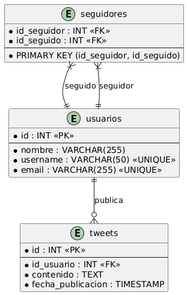
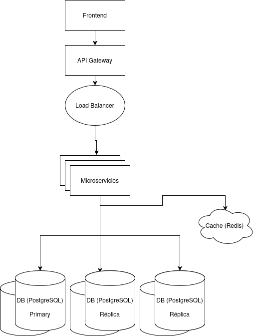

# Twitter
  
Web api que permite a usuarios crear tweets, seguir otros usuarios y ver un timeline que muestra los ultimos tweets de sus usuarios seguidos.

- [Twitter](#twitter)
  - [Cómo levantar el proyecto](#cómo-levantar-el-proyecto)
    - [Requerimientos](#requerimientos)
  - [Funcionamiento](#funcionamiento)
  - [Arquitectura interna](#arquitectura-interna)
  - [Elección de Base de Datos](#elección-de-base-de-datos)
  - [Arquitectura high level](#arquitectura-high-level)

## Cómo levantar el proyecto

### Requerimientos
- Docker y docker compose

Ubicarse en el root del proyecto y ejecutar el siguiente comando:

```sh
docker compose up
```
Esto levantará la aplicación en localhost:5280.

Cómo alternativa se podría levantar con el comando, también estando ubicados en el root del proyecto (para esta alternativa es necesario la sdk de dotnet 9):
```sh
dotnet run --project src/Web/Web.csproj
```

## Funcionamiento
La aplicación usa una base de datos in memory y al ser levantada levantará también en (http://localhost:5280/swagger/index.html) la documentación de todos los endpoints disponibles, lista para usar.

El endpoint POST http://localhost:5280/seeding facilitará algunas pruebas, ya que carga en la base de datos 5 usuarios, con 30 tweets cada uno. Además el usuario con id `5fb37814-2ada-432c-bc49-f711b99020fc` seguirá ya a los otros usuarios. Este endpoint sólo tiene este efecto si no se cuenta con usuarios ni tweets cargados.

Si queremos conocer la timeline de dicho usuario debemos utilizar el endpoint GET http://localhost:5280/Tweet/timeline con los parametros UserId, Page y PageSize correspondientes. El uso de paginación es debido a que la cantidad de tweets que pueden aparecer en la timeline es muy grande, entonces para consultas más eficientes, se hacen con un offset y un limit.

Otros endpoints útiles son los de POST http://localhost:5280/Tweet para crear un tweet para un usuario específico, o http://localhost:5280/User/{userId}/follow para que un usuario siga a otro.

Se puede observar y utilizar el resto de endpoints en swagger (http://localhost:5280/swagger/index.html).

## Arquitectura interna

Dentro de src/ se ha utilizado el esquema de una clean architecture para la organización internal del código. Se observan 4 capas principales:
- Domain: Entidades, filtros, interfaces de repositorios
- Application: Constantes, casos de uso (los cuales siguen el patrón CQRS para dividir la lógica)
- Infrastructure: Data (Database context), implementaciones de los repositorios (en donde se conectan a base de datos)
- Web: Controllers y program

Se ha utilizado la arquitectura descripta debido a que aporta mantenibilidad, escalabilidad, testeabilidad y una clara separación de responsabilidades entre las capas mencionadas.

También en Test/ se podrán encontrar los distintos test unitarios para los casos de uso principales de la aplicación.

## Elección de Base de Datos

A pesar de que el proyecto se realizó con una base de datos en memoria a fines de facilitar el desarrollo,
la aplicación utilizaría una base de datos `PostgreSQL`. Esta base de datos relacional sería útil para el tipo de consultas que se espera en la que las relaciones entre las entidades son algo complejas (por ejemplo: tweets de usuarios seguidos por un usuario, o sea, la timeline). Para la optimización de este tipo de lecturas se contarían con un `índice` compuesto sobre la tabla de tweets para la fecha de publicación y para el usuario de dicho tweet. También otra técnica que puede resultar útil es la de `particionamiento`, aplicada específicamente sobre la tabla tweets a partir de la fecha de publicación.



## Arquitectura high level
La arquitectura propuesta para el final de este proyecto sería como se muestra en el siguiente diagrama:



El load balancer se encarga de distribuir el tráfico en las distintas servidores de microservicios. Los microservicios buscarán primero los datos necesarios en la cache y en caso de no encontrarse ahí, en las bases de datos postgreSQL. En cuanto a las bases de datos: en la primary se manejan operaciones de escritura y en las replica de lectura. Es importante que se mantengan sincronizadas. Además de la replicación, se aplica también un particionamiento de los datos. Estas técnicas ayudan a la escalabilidad y performance de la solución.
